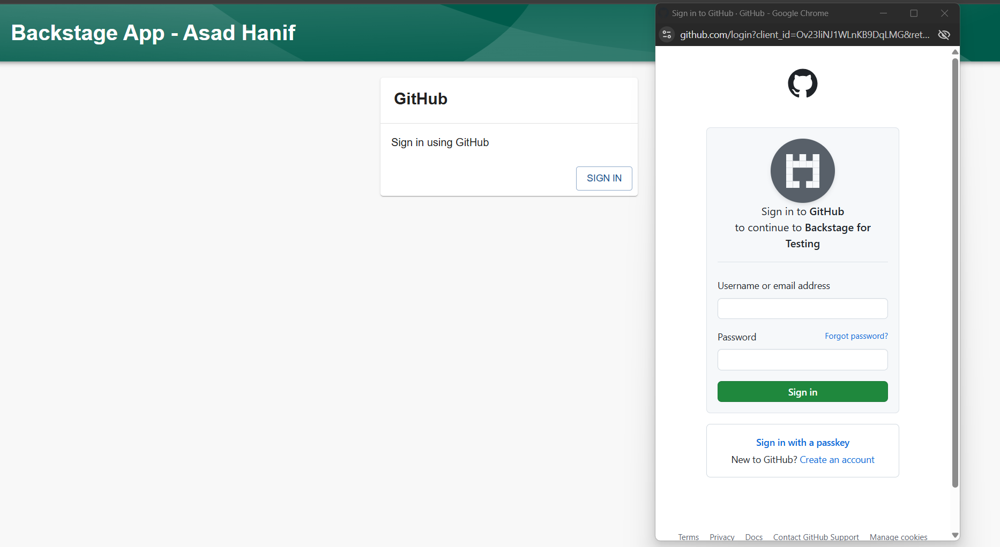

# [Backstage](https://backstage.io)

This is your newly scaffolded Backstage App, Good Luck!

To start the app, run:

```sh
yarn install
yarn start
```

## Few Screenshots


<br>

<br>

<br>


## Setup Techdocs in Backstage

We need to run following commands within the container to enable techdocs.

```
apt-get update && \
    apt-get install -y python3 python3-pip python3-venv && \
    rm -rf /var/lib/apt/lists/*

export VIRTUAL_ENV=/opt/venv

python3 -m venv $VIRTUAL_ENV

export PATH="$VIRTUAL_ENV/bin:$PATH"

pip3 install mkdocs-techdocs-core
```

